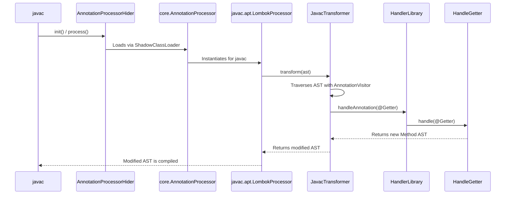

# Research: Analysis of Lombok's Annotation Processing Flow

**Date**: 2026-06-17T07:10:21+02:00
**Researcher**: Gemini
**Git Commit**: 0be1700fa5e5258a5fce4761e6ac42305045e070
**Branch**: master
**Repository**: lombokai

## Research Question

The user requested a detailed analysis of the method and function invocation process based on Lombok's annotations, with a focus on areas defined in `context/map/repo-map.md`. The goal is to understand the internal mechanisms, identify technical debt, and assess test coverage and experimental features.

## Summary

Lombok employs a sophisticated, multi-layered architecture to hook into the Java compilation process and manipulate the Abstract Syntax Tree (AST) in-memory. The process begins with a standard Java Annotation Processor entry point but quickly delegates to a custom class-loading and compiler-patching mechanism. This allows for deep integration but introduces significant technical debt in the form of brittle, reflection-based hacks and a near-complete lack of unit tests for critical path components. While end-to-end functionality is well-tested via integration tests, the internal machinery is opaque and fragile. Furthermore, the project carries a number of stagnant "experimental" features that represent a long-term maintenance burden.

---

## Feature Overview: Annotation Processing E2E Flow

The execution path for a typical annotation like `@Getter` is not a simple annotation processor pass, but a complex sequence of delegation and AST manipulation.

**Step-by-Step Breakdown:**

1.  **Compiler Hook (Entry Point):** `javac` discovers Lombok via the `META-INF/services/javax.annotation.processing.Processor` file, which points to `lombok.launch.AnnotationProcessorHider$AnnotationProcessor`.
2.  **Shadow ClassLoader Bridge:** This "Hider" processor uses a custom `ShadowClassLoader` to load `lombok.core.AnnotationProcessor`. This is a critical step that isolates Lombok's internal dependencies from the user's project classpath, preventing conflicts.
3.  **Core to Compiler-Specific Dispatch:** `lombok.core.AnnotationProcessor` acts as a dispatcher. It detects the compiler environment (e.g., `javac`) and uses reflection to load and delegate to the appropriate implementation, `lombok.javac.apt.LombokProcessor`.
4.  **Javac Integration & Patching:** `LombokProcessor` performs "deep magic" by using reflection to patch `javac`'s internal components, most notably replacing the `JavaFileManager`. This allows it to intercept and modify the AST before the compiler writes bytecode.
5.  **AST Transformation:** The processor initiates the transformation by calling `lombok.javac.JavacTransformer`. This class is the orchestrator for all AST modifications.
6.  **Annotation Discovery:** `JavacTransformer` traverses the source code's AST using a visitor pattern (`AnnotationVisitor`) to find all Lombok annotations.
7.  **Handler Dispatch:** When an annotation (e.g., `@Getter`) is found, it is passed to `lombok.javac.HandlerLibrary`. This library, which discovers all available handlers via SPI, calls the specific handler for the annotation, in this case `lombok.javac.handlers.HandleGetter`.
8.  **Code Generation:** The `handle()` method within `HandleGetter` contains the final logic. It uses a `JavacTreeMaker` to construct the AST for the new getter method and injects this new AST node directly into the parent class's AST.
9.  **Final Compilation:** `javac` resumes its process, now operating on the modified AST, and writes out the final `.class` file, which now includes the Lombok-generated method.

---

## Technical Debt

The analysis of test coverage and experimental features reveals two major areas of technical debt.

### 1. Test Coverage Gaps and Brittle Internals

Lombok's testing strategy relies almost exclusively on high-level, end-to-end integration tests. While this ensures that features work as expected for the end-user, it masks significant fragility in the core components.

*   **Primary Testing Method:** A custom `DirectoryRunner` framework compiles `before` source files, applies the Lombok transformations, and compares the resulting code (`after-delombok`) or compiler error messages (`messages`) against expected outputs. This provides excellent coverage for feature-level use cases.
*   **Identified Gaps:**
    *   **No Unit Tests for Core Logic:** Critical internal components like `JavacTransformer`, `LombokProcessor`, and the `AnnotationProcessorHider` are **not** covered by any isolated unit tests. Their correctness is only inferred from the success of the integration tests. This makes refactoring risky and debugging difficult, as the failure point of a complex internal interaction is not easily isolated.
    *   **Brittle Compiler Hacks:** The core of Lombok's integration relies on reflection and `sun.misc.Unsafe` to modify the private, internal state of the Java compiler. These hacks are inherently fragile and prone to breaking with new JDK releases. There are no specific, focused tests for these hacks themselves; the project waits for an integration test to fail to discover that a new compiler version has broken the reflective access.
    *   **Untested Internal Error States:** It is unclear how unexpected exceptions or errors within the transformation pipeline itself (e.g., a handler crashing) are tested. The test suite focuses on validating compiler errors from *user code*, not runtime errors from *Lombok's code*.

### 2. Stagnant and Risky Experimental Features

Lombok carries a significant number of features marked as "experimental." While some are actively developed, others have been stagnant for years, representing a maintenance burden and a risk to users who adopt them.

*   **Feature Status:**
    *   **Active Development:** `@SuperBuilder` (~2018) and `@Jacksonized` (~2020) are newer, widely used, and appear on a path to becoming core features.
    *   **Stable but Un-promoted:** `@Accessors` and `@FieldDefaults` (~2012) are considered stable but are blocked from promotion due to unresolved design considerations.
    *   **Stagnant / At-Risk:** `@Delegate` (~2010) and `@UtilityClass` (~2015) are marked with a 'negative' status in the official documentation, indicating they have known bugs and are unlikely to ever be promoted. These represent a significant form of technical debt, as they are available to users but are not actively maintained.
    *   **Abandoned Experiment:** `DisableCheckedExceptions` (~2009) is a deep, undocumented experiment that lives in a separate source tree and has been effectively abandoned.

The existence of decade-old, unmaintained experimental features creates a confusing landscape for users and adds to the cognitive load for new contributors. These features are a debt that has not been "paid down" by either promoting them to core or officially removing them.

## Code References

*   **Entry Point:** `src/launch/lombok/launch/AnnotationProcessor.java`
*   **Core Dispatcher:** `src/core/lombok/core/AnnotationProcessor.java`
*   **Javac Patcher:** `src/core/lombok/javac/apt/LombokProcessor.java`
*   **AST Orchestrator:** `src/core/lombok/javac/JavacTransformer.java`
*   **Handler Library:** `src/core/lombok/javac/HandlerLibrary.java`
*   **Example Handler:** `src/core/lombok/javac/handlers/HandleGetter.java`
*   **Test Framework:** `test/core/src/lombok/DirectoryRunner.java`
*   **Experimental Annotations Source:** `src/core/lombok/experimental/`
*   **Experimental Documentation:** `website/templates/features/experimental/`
creates `JavacTransformer`. | `ast-grep` | **Confirmed** | `new JavacTransformer(...)` found in `LombokProcessor.java:99`. |
| 4. `JavacTransformer` uses `AnnotationVisitor`. | `ast-grep` | **Confirmed** | `new AnnotationVisitor(...)` found in `JavacTransformer.java:67`. |
| 5. `HandlerLibrary` dispatches to handlers. | `grep` & `ast-grep`| **Confirmed** | `JavacTransformer` calls `handlers.handleAnnotation(...)`. `HandlerLibrary` then calls a generic `handler.handle(...)`. |
| 6. No isolated unit tests for core components. | `ast-grep` | **Confirmed** | No imports for `JavacTransformer`, `LombokProcessor`, or `AnnotationProcessorHider` were found in any files under `/test`. |
| 7. Codebase relies on `sun.misc.Unsafe` and Reflection. | `ast-grep` | **Confirmed** | Found `sun.misc.Unsafe` imports in critical processor classes and widespread use of `java.lang.reflect`. |

---

## Code References
*   **Entry Point:** `src/launch/lombok/launch/AnnotationProcessor.java`
*   **Core Dispatcher:** `src/core/lombok/core/AnnotationProcessor.java`
*   **Javac Patcher:** `src/core/lombok/javac/apt/LombokProcessor.java`
*   **AST Orchestrator:** `src/core/lombok/javac/JavacTransformer.java`
*   **Handler Library:** `src/core/lombok/javac/HandlerLibrary.java`
*   **Example Handler:** `src/core/lombok/javac/handlers/HandleGetter.java`
*   **Test Framework:** `test/core/src/lombok/DirectoryRunner.java`
*   **Experimental Annotations Source:** `src/core/lombok/experimental/`
*   **Experimental Documentation:** `website/templates/features/experimental/`
